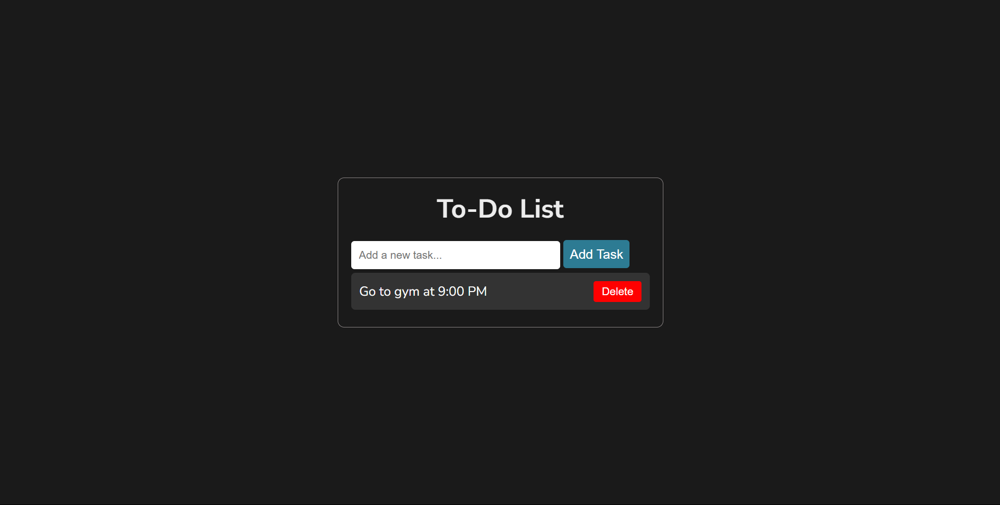
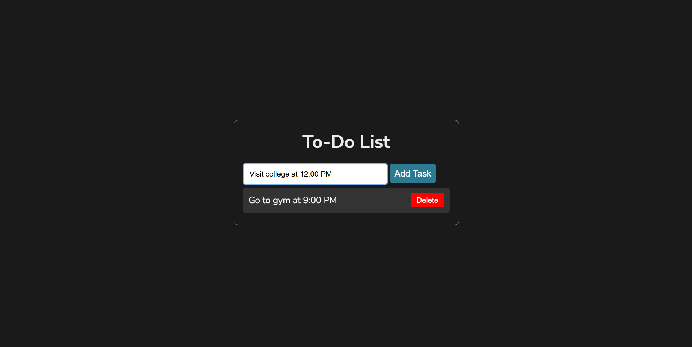
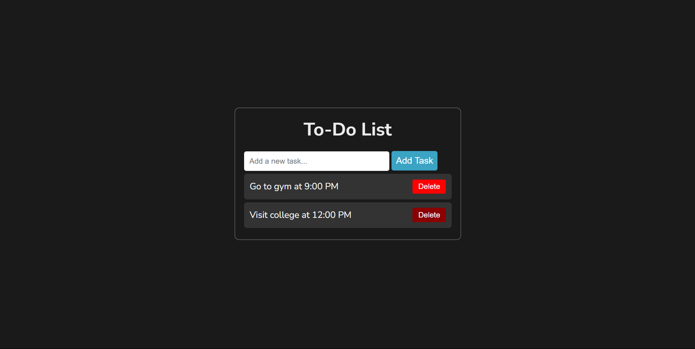

# Todo List App  
A simple and interactive Todo List application built using HTML, CSS, and JavaScript. This app helps users organize their tasks and keep track of their to-dos. The tasks are stored in the browser's local storage, ensuring data persistence even after the browser is closed.  

---

## Features  
- Add new tasks to the list.  
- Mark tasks as completed.  
- Delete tasks from the list.  
- Persistent data storage using **localStorage**.  
- User-friendly interface with dynamic updates.  

---

## Technologies Used  
- **HTML**: Structure of the application.  
- **CSS**: Styling the application for a clean and modern look.  
- **JavaScript**: Implementing the core functionality and dynamic updates.  

---

## How It Works  
1. **Adding a Task**:  
   Enter a task in the input field and click the "Add" button. The task will be added to the list and stored in the browser's local storage.  
   

2. **Marking a Task as Completed**:  
   Click on a task to mark it as completed. Completed tasks are styled differently for easy identification.  
   

3. **Deleting a Task**:  
   Click the delete icon (or button) next to a task to remove it from the list and local storage.  
   

4. **Data Persistence**:  
   All tasks are stored in the browser's local storage, so you can close the app and reopen it later without losing your data.  

---

## Installation and Usage  
1. Clone the repository to your local machine:  
   ```bash  
   git clone https://github.com/your-username/todo-list-app.git
